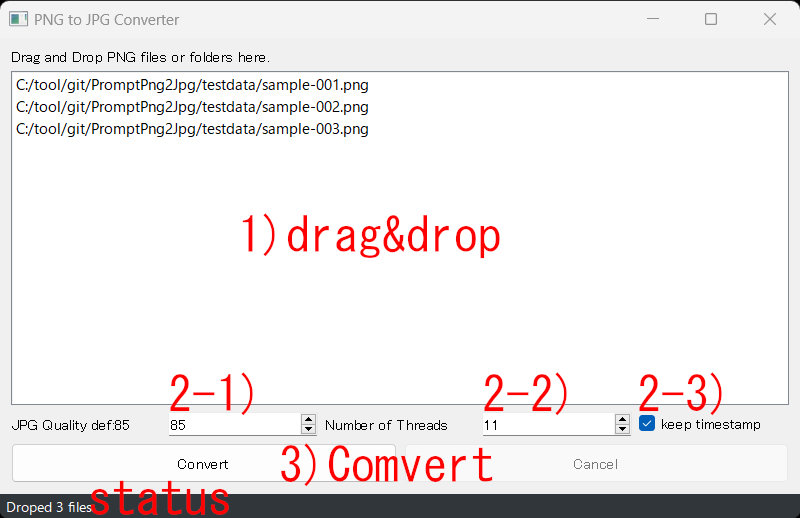

-=-=-=-=-=  
これは以下のソフトの下位互換版となります。通常は下のものを利用してください  
This software is a backward compatible version of the following. Normally, you should use the lower version.  
[SdImageDiet](https://github.com/nekotodance/SdImageDiet)  
-=-=-=-=-=  
  
## PromptPng2Jpgについて 0.1.1
StableDiffusionで作成したPNG画像をプロンプト情報を保持したままJPG画像に変換します  

## 特徴
- JPG変換後のファイルでもPNG Infoタブで読み込み、Prompt情報や設定値をtxt2txtなどに送る事が可能  
- マルチスレッドで高速に動作 ※1  
- 複数ファイル、フォルダのドラッグ＆ドロップに対応 ※2
- お好みでGUIでもCUIでも利用可能  
- 変換したjpgファイルのタイムスタンプを元のpngファイルに合わせる事も可能

※1:Ryzen5 5600で1024x1344dotのpng1000枚をjpgに変換するのに5秒程度  
※2:GUI版のみ

## インストール方法（簡易）
[簡易インストール版zipのダウンロード] https://github.com/nekotodance/PromptPng2Jpg/releases/download/latest/PromptPng2JpgGUI.zip

- zipファイルを解凍
- 解凍したフォルダ内の「PromptPng2Jpg-install.ps1」を右クリックして「PowerShellで実行」を選択
- イントールの最後にデスクトップにリンクをコピーするかどうかを聞いてきます  
「"Do you want to copy the shortcut to your desktop? (y or enter/n)」  
必要があれば「y」入力後、もしくはそのまま「enter」キー  
必要なければ「n」入力後「enter」キー  
- PromptPng2JpgGUIリンクが作成されます

リンクファイルをダブルクリックして起動できます

## インストール方法（手動）
インストールフォルダをC:\tool\git\PromptPng2Jpgとした場合で説明  
！Pythonはインストールされていて最低限の知識はあるものとします！  

#### 1)C:\tool\git\PromptPng2Jpgを作成
#### 2)以下のファイルを格納
  PromptPng2Jpg.py  
  PromptPng2JpgGUI.py  
  pvsubfunc.py

#### 3)コマンドプロンプトを立ち上げて以下を実行する。この手順はインストールの一度のみ
###### 3-1)カレントフォルダの移動移動
    c:
    cd C:\tool\git\PromptPng2Jpg
###### 3-2)venv環境を作成、activate
    py -m venv venv
    .\venv\Scripts\activate.bat
###### 3-3)利用するライブラリをインストール
    pip install PyQt5 Image piexif
###### 3-4)動作確認
    py PromptPng2JpgGUI.py
    
#### 4)起動に便利なショートカットの作成
  適当なフォルダで右クリックして「新規作成」->「ショートカット」  
「項目の場所を...」に以下を入力
  C:\tool\git\PromptPng2Jpg\Scripts\pythonw.exe C:\tool\git\PromptPng2Jpg\PromptPng2JpgGUI.py  
  
  今後は作成したショートカットをダブルクリックでアプリのように使えます  

## 利用方法（GUI版）

#### 1)アプリ上に複数のPNG画像ファイルかフォルダをドラッグ＆ドロップしてください  

#### 2)必要があれば設定値を変更  
###### 2-1)JPG Quality
JPG品質は1-100が指定でき、デフォルト値は85としています  
100だとたいして小さくなりませんし、50とかにするとファイルサイズは小さくなりますがJpgノイズが目立ちます  
お好みの値に調整してください（デフォルト値の85は、個人的に我慢できる限界の値）  
###### 2-2)Number of Threads
スレッド数は1-「CPUの最大スレッド数」が指定でき、デフォルト値は「CPUの最大スレッド数 - 1」としています  
CPUの最大スレッド数を指定した方がほんの少しだけ早く終わりますが、OS動作がカクカクするかもしれません  
###### 2-3)keep timestamp
チェックした場合、変換したjpgのタイムスタンプを元のPNGファイルに合わせます  
shutil.copystat()を利用しているため最終更新日時以外のファイル情報もコピーされます  

#### 3)Convertボタンを押す  
変換を開始します ※3  
一応Cancelボタンを設けていますが、何千何万枚でなければすぐに終わります

#### status
ファイルのドラッグ＆ドロップ時や変換実行後など、処理状況を表示します

※3:GUI版ではPNGファイルと同じフォルダにJPGファイルを出力します

## 利用方法（コマンドライン版）
以下の方法で利用できます  
usage: PromptPng2Jpg.py [-h] [--quality QUALITY] [--threads THREADS] [--keeptimestamp] input output  
  
Convert PNG to JPG with metadata.  
  
positional arguments:  
  input              : Input file or directory containing PNG files.  
  output             : Output directory for JPEG files.  
  
options:  
  -h, --help         : show this help message and exit  
  --quality QUALITY  : JPEG quality (1-100). Default is 85.  
  --threads THREADS  : Number of threads for parallel processing. Default is CPU Max Thread - 1.  
  --keeptimestamp    : keep the original timestamp of PNG files.  

## 注意事項
- Prompt情報はjpgのExifのUserCommentに保存しています  
- Automatic1111とForgeの出力したPNGファイルでしか確認していません  
- アプリによってはjpgのExifコメントの文字コードを正確に判断できないかもしれませんが、ForgeのPNG Infoでの読み込みが正常に行われる事を優先しました  

## 変更履歴
- 0.1.1 変換元のPNGファイルのタイムスタンプを保持する設定を追加
- 0.1.0 初版

以上
